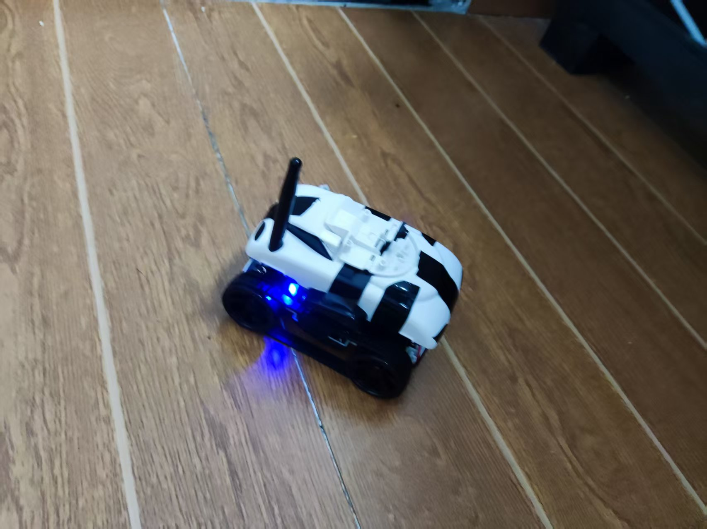
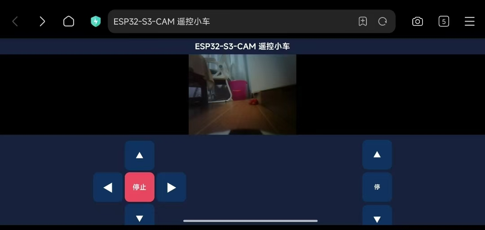

# ESP32-S3 WiFi 摄像遥控小车

基于 ESP32-S3 + OV2640 的 WiFi 摄像遥控小车：手机连接热点后打开网页，即可**边看实时画面边遥控小车和云台**。

## 效果展示

| 实物 | 网页遥控界面 |
|------|-------------|
|  |  |

## 功能特性

- 实时 MJPEG 视频流（VGA 640×480 @ ~25fps，XCLK 24MHz）
- 网页遥控：前进 / 后退 / 差速转弯 / 停止
- 云台俯仰控制
- 视频、控制**同一页面**，双核并行不卡顿
  - Core 0：MJPEG 推流任务（FreeRTOS）
  - Core 1：WebServer 处理控制请求，秒响应
- SoftAP 热点模式，无需路由器，手机直连即用
- 串口实时输出帧率 / 帧大小 / 发送耗时等诊断信息

## 硬件清单

| 模块 | 型号/说明 |
|------|-----------|
| 主控 | ESP32-S3-WROOM（N16R8，16MB Flash + 8MB OPI PSRAM）ESP32-S3-CAM 开发板 |
| 摄像头 | OV2640（DVP 接口，带 FPC 排线） |
| 电机驱动 | TB6612FNG ×2（一路驱动左轮，一路驱动右轮；另一路驱动云台电机） |
| 底盘 | 双直流减速电机小车底盘 |
| 云台 | 单自由度俯仰直流减速电机 |
| 电源 | 2S 锂电池 7.4V（给 TB6612 的 VM 供电，需 ≥3A 放电能力） |

## 接线说明

### 摄像头（OV2640 → ESP32-S3）

| OV2640 | ESP32-S3 | | OV2640 | ESP32-S3 |
|--------|----------|-|--------|----------|
| XCLK | GPIO15 | | D0 | GPIO11 |
| SIOD (SDA) | GPIO4 | | D1 | GPIO9 |
| SIOC (SCL) | GPIO5 | | D2 | GPIO8 |
| VSYNC | GPIO6 | | D3 | GPIO10 |
| HREF | GPIO7 | | D4 | GPIO12 |
| PCLK | GPIO13 | | D5 | GPIO18 |
| PWDN / RESET | 悬空 | | D6 | GPIO17 |
| | | | D7 | GPIO16 |

### 底盘电机（TB6612 → ESP32-S3）

| TB6612 | ESP32-S3 | 说明 |
|--------|----------|------|
| PWMA | GPIO42 | 左轮 PWM |
| AIN1 | GPIO40 | 左轮方向 |
| AIN2 | GPIO41 | 左轮方向 |
| PWMB | GPIO47 | 右轮 PWM |
| BIN1 | GPIO48 | 右轮方向 |
| BIN2 | GPIO38 | 右轮方向 |
| STBY | GPIO39 | 使能 |

### 云台电机（TB6612 → ESP32-S3）

| TB6612 | ESP32-S3 | 说明 |
|--------|----------|------|
| PWMA | GPIO19 | 云台 PWM |
| AIN1 | GPIO21 | 云台方向 |
| AIN2 | GPIO20 | 云台方向 |
| STBY | 3.3V | 常使能 |

> GPIO 19/20/21 在开发板左侧排针上物理相邻，方便接线。

## 软件准备（Arduino IDE）

1. **安装 ESP32 开发板包**：开发板管理器搜索 `esp32`（by Espressif Systems），建议 3.x
2. **工具菜单关键设置**：

| 设置项 | 值 |
|--------|-----|
| 开发板 | ESP32S3 Dev Module |
| **PSRAM** | **OPI PSRAM**（必须！否则摄像头初始化失败） |
| Flash Size | 16MB |
| USB CDC On Boot | Enabled |

3. 打开 `esp32_s3_cam_ov2640/esp32_s3_cam_ov2640.ino`，编译上传

## 使用方法

1. 上电后板子发出 WiFi 热点：**ESP32-S3-CAR**（无密码）
2. 手机连接该热点（提示"无法访问互联网"时选择"保持连接"）
3. 建议关闭手机移动数据和"WLAN+"智能网络切换，避免安卓自动切回流量
4. 浏览器打开 **http://192.168.4.1/**
5. 页面上方为实时画面，下方为方向盘和云台按钮（按住即动，松开即停）

> 想改为连接家里路由器（STA 模式）：取消代码中 `ssid/password` 的注释，并按代码内注释把 `WiFi.softAP(...)` 换成 `WiFi.begin(ssid, password)`，串口会打印分配到的 IP。

## 参数调优

代码顶部集中了常用参数：

| 参数 | 默认值 | 说明 |
|------|--------|------|
| `SPEED_LEFT / SPEED_RIGHT` | 138 | 前进后退速度，跑偏时按 ±5 微调 |
| `TURN_SPEED` | 100 | 转弯速度（当前为差速转弯，实际用到前进速度） |
| `SPEED_YT` | 60 | 云台速度 |
| `frame_size` | `FRAMESIZE_VGA` | 分辨率，卡顿可降为 `FRAMESIZE_CIF` |
| `jpeg_quality` | 12 | 数值越小越清晰、帧越大（10~20 合理） |
| `xclk_freq_hz` | 24 MHz | 出现横向条纹时降回 20 MHz |

## 常见问题排查

| 现象 | 原因 / 解决 |
|------|-------------|
| `0x105 (ESP_ERR_NOT_FOUND)` | 摄像头未识别：检查排线方向，确认 PSRAM 已设为 OPI PSRAM |
| `frame buffer malloc failed` | PSRAM 未启用，工具菜单设置 OPI PSRAM |
| 画面横向彩色条纹 | XCLK 过高，把 24MHz 降为 20MHz 或 10MHz |
| 控制/画面严重延迟 | 用板子热点直连（SoftAP），手机热点转发性能普遍很差 |
| 原地转弯电机"哔哔响"不转 | 电池放电能力不足导致电压跌落，换动力电池；本代码已改为差速转弯规避 |
| 直行跑偏 | 直流电机个体差异，微调 `SPEED_LEFT / SPEED_RIGHT` |

## 工作原理

```
┌──────────────────────┐     ┌──────────────────────┐
│ Core 0 (推流任务)     │     │ Core 1 (loop 主循环)  │
│ esp_camera_fb_get()  │     │ server.handleClient()│
│ client.write(JPEG)   │     │ 处理主页/电机控制请求  │
│ :81 →  视频流   │     │ :80 → 控制 API       │
└──────────────────────┘     └──────────────────────┘
```

- 摄像头帧缓冲放 PSRAM，双缓冲
- 电机 PWM 用 LEDC 通道 2/3/4，刻意避开摄像头占用的 TIMER_1/CHANNEL_1
- 网页按钮通过 `mousedown/mouseup`（兼容 `touchstart/touchend`）实现按住持续运动

## 许可证

[MIT](LICENSE)
